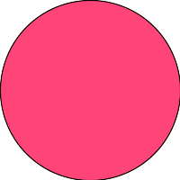

====
svgo
====

|nimble-version| |nimble-install| |gh-actions|

This is svgo, a small utility to create SVG objects.
This was inspired by `jpmens/jo <https://github.com/jpmens/jo>`_.

.. contents:: Table of contents

Usage
=====

Basic usage
-----------

`-W` is a width of `svg` tag elements.
`-H` is a height of `svg` tag elements.
Default values are `200`.

.. code-block:: shell

   $ svgo -W 400 -H 400 [ circle cx=200 cy=200 r=200 stroke=teal fill='#DDD' ]

   <?xml version="1.0" encoding="UTF-8" ?>
   <!DOCTYPE svg PUBLIC "-//W3C//DTD SVG 1.1//EN" "http://www.w3.org/Graphics/SVG/1.1/DTD/svg11.dtd">
   <svg version="1.1" width="400" xmlns="http://www.w3.org/2000/svg" height="400"><circle cy="200" cx="200" fill="#DDD" stroke="teal" r="200" /></svg>

Save file. (`-o`)

.. code-block:: shell

   $ svgo -o out.svg [ circle cx=200 cy=200 r=200 stroke=teal fill='#DDD' ]

Nested elements.

.. code-block:: shell

   $ svgo [ g [ circle cx=100 cy=100 r=80 stroke=teal fill="#DDD" ] [ circle cx=100 cy=100 r=80 stroke=teal fill="#DDD" ] ]

   <?xml version="1.0" encoding="UTF-8" ?>
   <!DOCTYPE svg PUBLIC "-//W3C//DTD SVG 1.1//EN" "http://www.w3.org/Graphics/SVG/1.1/DTD/svg11.dtd">
   <svg version="1.1" width="200" xmlns="http://www.w3.org/2000/svg" height="200"><g>
       <circle cy="100" cx="100" fill="#DDD" stroke="teal" r="80" />
       <circle cy="100" cx="100" fill="#DDD" stroke="teal" r="80" />
     </g></svg>

Use stdin fields. (`-i`)

.. code-block:: shell

   $ seq 0 25 100 | svgo [ circle cx=100 cy=100 r='$1' ] -i

   <?xml version="1.0" encoding="UTF-8" ?>
   <!DOCTYPE svg PUBLIC "-//W3C//DTD SVG 1.1//EN" "http://www.w3.org/Graphics/SVG/1.1/DTD/svg11.dtd">
   <svg version="1.1" width="200" xmlns="http://www.w3.org/2000/svg" height="200"><circle cy="100" cx="100" r="0" /></svg>
   <?xml version="1.0" encoding="UTF-8" ?>
   <!DOCTYPE svg PUBLIC "-//W3C//DTD SVG 1.1//EN" "http://www.w3.org/Graphics/SVG/1.1/DTD/svg11.dtd">
   <svg version="1.1" width="200" xmlns="http://www.w3.org/2000/svg" height="200"><circle cy="100" cx="100" r="25" /></svg>
   <?xml version="1.0" encoding="UTF-8" ?>
   <!DOCTYPE svg PUBLIC "-//W3C//DTD SVG 1.1//EN" "http://www.w3.org/Graphics/SVG/1.1/DTD/svg11.dtd">
   <svg version="1.1" width="200" xmlns="http://www.w3.org/2000/svg" height="200"><circle cy="100" cx="100" r="50" /></svg>
   <?xml version="1.0" encoding="UTF-8" ?>
   <!DOCTYPE svg PUBLIC "-//W3C//DTD SVG 1.1//EN" "http://www.w3.org/Graphics/SVG/1.1/DTD/svg11.dtd">
   <svg version="1.1" width="200" xmlns="http://www.w3.org/2000/svg" height="200"><circle cy="100" cx="100" r="75" /></svg>
   <?xml version="1.0" encoding="UTF-8" ?>
   <!DOCTYPE svg PUBLIC "-//W3C//DTD SVG 1.1//EN" "http://www.w3.org/Graphics/SVG/1.1/DTD/svg11.dtd">
   <svg version="1.1" width="200" xmlns="http://www.w3.org/2000/svg" height="200"><circle cy="100" cx="100" r="100" /></svg>

Animation GIF
-------------

You can generate animation GIF with ImageMagick (`convert`).

.. code-block:: shell

   $ (seq 1 10 100; seq 100 -10 0) | svgo [ circle cx=100 cy=100 r='$1' ] -in -w 3 -o 'out_$NR.svg'
   $ convert -density 1200 -resize 200x200 out_*.svg anim1.gif

|image-demo-anim1|

.. code-block:: shell

   $ (seq 5 | awk '{print $1 * 40, 200}' | tee >(awk '{print $2, $1}')) | svgo [ rect x=0 y=0 width='$1' height='$2' ] -ino 'out_$NR.svg'
   $ convert -resize 200x200 out*.svg anim2.gif

|image-demo-anim2|

.. code-block:: shell

   $ yes 'echo $((RANDOM % 200)) $((RANDOM % 200))' | head | bash | svgo [ circle cx='$1' cy='$2' r='50' ] -ino 'out_$NR.svg'
   $ convert -resize 200x200 out*.svg anim3.gif

|image-demo-anim3|

.. code-block:: shell

   $ seq -f 'obase=16; ibase=10; %g' 0 15 | bc | awk '{print $1, "0", "0"}' | svgo [ circle cx=100 cy=100 fill='#$1$2$3' r=100 ] -ino 'out_$NR.svg'
   $ convert -resize 200x200 out*.svg anim4.gif

|image-demo-anim4|

.. code-block:: shell

   $ seq 0 16 360 | svgo [ g rotate='$1' [ rect x=0 y=0 width=100 height=100 ] ] -ino 'out_$NR.svg'
   $ convert -resize 200x200 out*.svg anim5.gif

|image-demo-anim5|

.. code-block:: shell

   $ seq 10 2 30 | svgo -i [ text x=0 y='$1' font-size='$1' TEXT=HelloWorld ] -no 'out_$NR.svg'
   $ convert -resize 200x200 out*.svg anim6.gif

|image-demo-anim6|

.. code-block:: shell

   $ r=100
     j=0
     for i in f47 d47 b47 947 747 547 347 147 047 027; do
       j=$((j+1))
       svgo [ circle cx=100 cy=100 r=$r fill="#$i" ] > out_$(printf %02d $j).svg
       r=$((r-10))
     done
   $ convert out*.svg anim7.gif

|image-demo-anim7|

Installation
============

.. code-block:: shell

   $ nimble install -Y svgo

or install binaries from `Releases <https://github.com/jiro4989/svgo/releases>`_.

Special variables
=================

Field variables ($1, $2, ... $NF)
---------------------------------

Records are read in stdin at a time, and stored in the field variables.
The record is split into fields which are stored in $1, $2, ..., $NF like `awk`
when activate `-i (--use-stdin)` flag.

.. code-block:: shell

   $ seq 3 | svgo -i [ circle cx=100 cy=200 r='$1' ]

   # equals

   $ svgo [ circle cx=100 cy=200 r='1' ]
   $ svgo [ circle cx=100 cy=200 r='2' ]
   $ svgo [ circle cx=100 cy=200 r='3' ]

.. code-block:: shell

   $ seq 3 | awk '{print $1, $1*10}' | svgo -i [ circle cx='$1' cy='$2' r='$1' ]

   # equals

   $ svgo [ circle cx='1' cy='10' r='1' ]
   $ svgo [ circle cx='2' cy='20' r='2' ]
   $ svgo [ circle cx='3' cy='30' r='3' ]

Current record number (NR)
--------------------------

TODO

LICENSE
=======

MIT

See also
========

* `SVG 1.1 - W3C <https://www.w3.org/TR/SVG11/>`_

.. |gh-actions| image:: https://github.com/jiro4989/svgo/workflows/build/badge.svg
   :target: https://github.com/jiro4989/svgo/actions
.. |nimble-version| image:: https://nimble.directory/ci/badges/svgo/version.svg
   :target: https://nimble.directory/ci/badges/svgo/nimdevel/output.html
.. |nimble-install| image:: https://nimble.directory/ci/badges/svgo/nimdevel/status.svg
   :target: https://nimble.directory/ci/badges/svgo/nimdevel/output.html
